# Booking Reviews' Analysis 📊📝

**University:** Universidad Carlos III de Madrid  
**Subject:** Machine Learning Applications  
**Course:** 2024/2025  
**Authors:**

*   Amaia Rodríguez-Sierra Aguirrebeña _100472844_
*   Lucía de Frutos Martín _100475960_
*   Francisco Landa Ortega _100483174_

---

## 📚 Table of Contents

*   [1\. Introduction](#1-introduction)
*   [2\. Dataset Creation](#2-dataset-creation)
*   [3\. Preprocessing](#3-preprocessing)
*   [4\. Text Vectorization](#4-text-vectorization)
*   [5\. Machine Learning Model](#5-machine-learning-models)
*   [6\. Dashboard](#6-dashboard)
*   [7\. Conclusions](#7-Conclusion)

---

## 1\. Introduction

This project aims to make a deep analysis from Booking's accomodation reviews using NLP techniques learnt during the course. Obtaining clusters, rating scores or analyzing reviews to reveal interesting insights. 

---

## 2\. Dataset Creation

We knew that a large number of reviews would be necessary in order to complete this task. Many sites appear to have tons of reviews, but there is one that rises above all, **Booking.** It serves as an online platform for booking plane tickets, accomodations, car rentals... That is, a place with tons of reviews. We will focus on analyzing accomodation reviews. 

[Booking](https://Booking.com) offers a paid API for retrieving information that is quite restricted and in order to access a propper number of reviews, a enterprise paid subscription is required. Thankfully, by applying our knowledge on Web Analytics, we tried to Web-Scrap the page. Although it seemed very easy at first, many domains in the page were locked to webscrappers so we checked the robots.txt and analyzed which ulrs may contain useful reviews. After some deep reseach, we found a [link](https://www.booking.com/sitembk-hotel-review-index.xml) which allowed us to retrieve lots of updated .gz files that contained urls to the review pages for around 130,000 accomodations. Each provided url contained a lot of reviews, so we just scrapped the first page of them.

In general terms, the review extraction is a quite slow process so parallelizing should be taken into account for further projects. Is important to attend good practices when scrapping exhaustively, in order to avoid issues like rate limiting, IP blocking, or excessive server load.

Our approach was simple, extract the .gz file and process it sequentially. After some analysis on the review page structure we captured where the items we needed to locate where and extracted them. Although it sounds an easy task, in order to retrieve all the first page reviews from the first .gz file and less than a quarter of the second one we spent 22h. Having retrieved around 960,000 reviews we thought was sufficient for our task.

The main problem we faced was that, due to our browser configuration, the reviews aswell as other parameters appeared in arabic. To solve it, we developed a small piece of code that used an unnoficial translator linked to Google Translator's API to translate into English the reviews and some accomodation names. This approach proved to be valid but quite inconsisten, as the API crashed randomly and stopped working, so from the 960,000 reviews we stayed with the first 72,000. Also a similar code was implemented to translate the country names, using an assyncronous function, to avoid errors when facing larger than expected response times. 

Once all reviews, hotel names an countries were translated, we got a dataframe with the following structure:

| Country | Name | Avg Rating | Review | Rating |
| --- | --- | --- | --- | --- |
| Spain | Riu Plaza España | 9.6 | Beautiful Hotel, nice services and great breakfast! | 10 |
| Italy | Nice Airport House at Bergamo | 8.0 | Close to the airport, good | 8.5 |
| Thailand | Beach Hostal at Bangkok | 7.2 | The place was a bit dirty, we had a bat in the room | 6 |

*   **Country** – The country where the hotel is located.
*   **Name** – The name of the hotel.
*   **Avg Rating** – The average rating of the hotel, calculated from multiple reviews.
*   **Review** – A user-written review describing their experience at the hotel.
*   **Rating** – The specific rating given by the user who wrote the review.

With our new dataset, we started to work.

---

## 3\. Preprocessing

### 3.0 Preprocesing Pipeline - Stage 0

An exploratory analysis checking simple information about the dataset was carried out, shape. NaN's count and othe simple opperations were made in order to ensure a propper and adecuate preprocessing.

### 3.1 Preprocesing Pipeline - Stage 1

The preprocessing task was totally crucial for this project, many subtasks were carried out in order to prepare the dataset for a propper classification/sentiment analysis. 

Due to the nature of the used translator, wrong translations were expected. So, to start with, using the Langdetect library we were able to locate errors in the translations (usually corresponding to '.', '..' or '...'), omissions in the translation (the review remained in arabic) or those reviews composed entirely by emojis. Once located, this rows were dropped together with those who whad a NaN as a review.

Once this first stage of preprocessing was completed, 62,000 rows remained, ready for the second stage, Text Cleaning and Homogenization.

### 3.2 Text Cleaning - Stage 2

After some exploratory analysis and by inspecting some reviews, we noticed that some of them required an extra step when cleaning the review text, emoji removal, underscores or short and repetitive reviews only containing 'nothing'. Lowercase conversion, punctuation signs, extra underscores and digits removal where other operations carried out.

Once all was set, these new preprocessed and cleaned reviews were stored in a new col `clean_review`.

### 3.3 Tokenization & Stopword Removal

By using tools learnt during the course like `nltk.word_tokenize`, we were able to tokenize our plain text reviews. We also removed a custom set of stopwords, our first approach consisted in just removing a predefined set of English stopwords, but later realized that negative stopwords were being removed, thus, transforming negative reviews into positive ones, loosing all context. Stopwords like **not**, **don't** or **very** were manyally added. Tokens shorter than 3 characters were discarded and the final result was stored in `tokens`.

### 3.4 Lemmatization

Right after the tokenization operation, we lemmatized the tokens using `spaCy`'s default pipeline. The result was saved in the same dataframe in a new col named `lemmatized` and `joined_lemmas`.

### 3.5 Exploratory Data Analysis

Finally, after such a long preprocessing, we performed some analysis on the reviews. To start with, the most common words of the reviews were plotted.

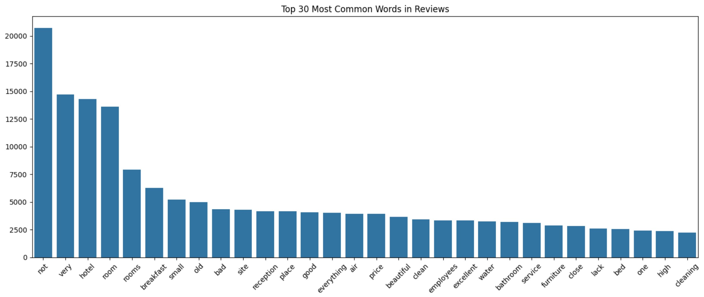

Notice how **not** and **very** appear a lot compared to other terms, in a first approach to the problem these two stopwords were removed, quite a bad decision. If we check other words we see some references to the rooms, hotel, some services, qualities and amenities. Our handcrafted dataset appears to be great indeed. 

We continued checking the length of the reviews.

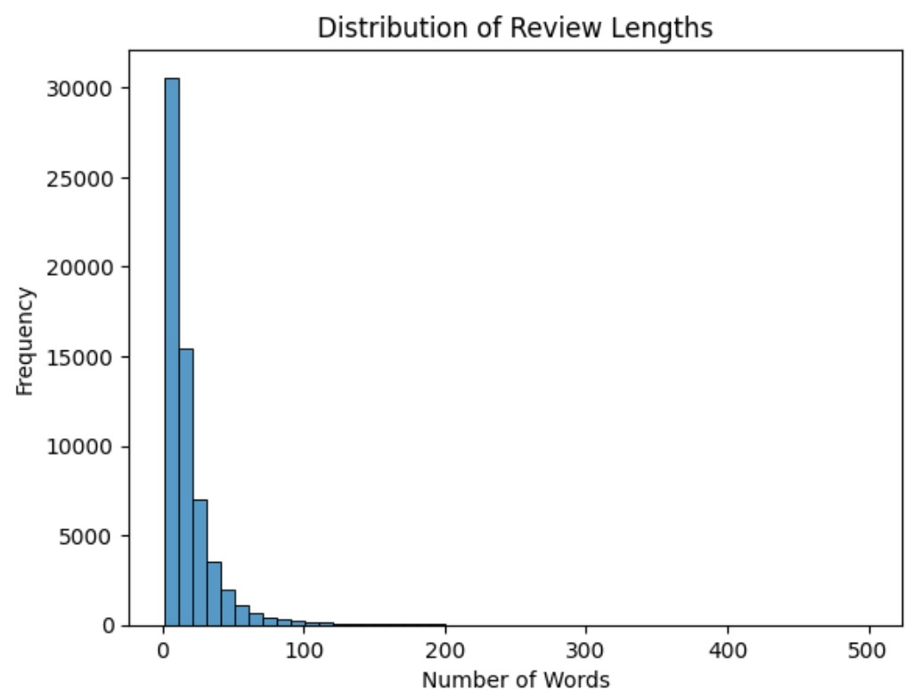

The plot illustrates how shorter reviews are more common that longer ones, this would  be taken into account in future steps in the project, as we do not need to have lenght or structure sensitive algorithms.

To have a better insight on the most common words among the reviews, shown as a wordcloud.

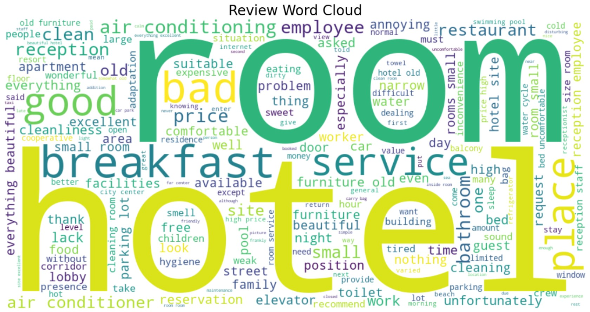

As an accomodation reviews dataset, words like room or hotel are of course, very common.

---

## 4\. Text Vectorization

In this section we well coment on some suggested techniques, as well as their performance or possible applications.

### 4.1 Classical Representations - BoW & TF-IDF

BoW models represent text as a set of word frequencies, we use `CountVectorizer()` to build the vocabulary from our corupus (located in the column joined\_lemmas). After this we perform the `fit_transform()` operation so we get the final sparse matrix.

We implement a very similar approach for obtaining the TF-IDF, this time using `TfidfVectorizer()` and the corresponding `fit_transform()`. To get an insight of the output for the TF-IDF we show the top 5 score words in the first available review, in our case the output is \[('away', 0.6978644379389985), ('far', 0.5546141589331018), ('service', 0.4531979269270918), ('يوم', 0.0), ('floorsknow', 0.0)\]. Notice how there are two 'wrong' words that are not taken into account whereas **far**, **service** and **away** are given larger scores; that is, their importance is high.

Both BoW and TF-IDF result in sparse and interpretable term features, great for traditional classifiers or logistic regressors. Being TF-IDF a bit more informative than BoW. 

### 4.3 GloVe Based Embedding

Pretrained embeddings can be a better approach for our project as the reviews use general language and we want deeper semantic relationships. In order to generate these word embeddings we could generate our own model, which will need larger corpus, more computation and time. This resulted in us moving to a better approach, using a pretrained model. GloVe was developed by Standford University trained on massive ammounts of data. Better than BoW/TF-IDF as we are context aware and more efficient. GloVe is trained on **Wikipedia 2014 + Gigaword 5** (6B tokens) **Common Crawl** (42B and 840B tokens) and **Twitter** (27B tokens).

### 4.4 Topic Modeling with LDA

Last but not least, LDA offers a representation of reviews as a mixture of topics. The key aspect is to select the propper ammount of Topics (usually between 5 and 15). 

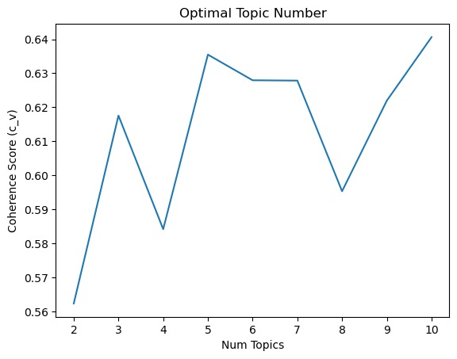

By computing a coherence score we got that the optimal number of topics was 5.

To check the content of our topics we developed an interactive plot. It enabled us to visuallize what key words where in each topic.

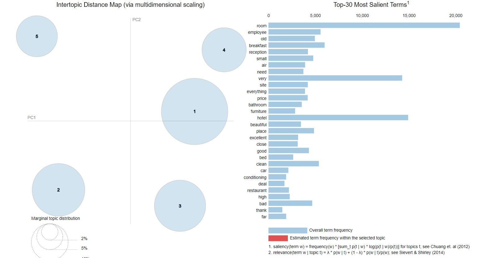

Here is a [link](./lda_model.html) to the interactive plot. A lambda parameter appears, when **λ = 1**, relevance shows the _most frequent_ words in a topic, contrary, when **λ = 0**, relevance favors _distinctive_ words: it shows the words that are _unique_ to a topic.

We could see that Topic 1 was referencing Booking issues and room access. Topic 2 focused on Positive mentions of breakfasts, cleanliness and location; that is, Hotel's strengths. Topic 3 was mostly focused on Room characteristics, size, condition, cleanliness... Topic 4 dealt with the state of the facilities of the hotel. Finally, Topic 5 was purelly feedback on staff and guest service.

This Topic Modeling allowed us to understand better the hidden topics in the text.

---

## 5\. Machine Learning Models

In this section, we are going to explain how we applied machine learning techniques to analyze and extract insight from our data. Two distinct subtasks were carried out: a regression task to predict review ratings, and a clustering task to group semantically similar reviews without using labeled output. Each task was approached using different text vectorization methods developed in the earlier stages.

### 5.1 RegressionTask

This was our first attempt, we tried to predict the numeric rating based on the content of the review. At first it seemed simple, but these were or results. The performance of the regression models was assessed using three standard metrics: RMSE, MAE, and R² Score. The key findings are as follows:

*   **Root Mean Squared Error (RMSE)** - This metric captures the average magnitude of prediction errors. Our model's observed RMSE values were approximately 2.1 to 2.2. Given that ratings range from 1 to 10, this suggests that, on average, predictions deviate from the true rating by around 2 points, which is relatively high and indicates limited model precision.
*   **Mean Absolute Error (MAE)** - Provides an average of the absolute differences between predicted and actual ratings. The models yielded an MAE of approximately 1.5, indicating that predictions were off by 1.5 points on average, another sign of imprecision in the predicted ratings.
*   **R² Score (Coefficient of Determination)** - This metric indicates how well the model explains the variability in the target variable. A value of 1.0 represents a perfect prediction, 0.0 indicates performance no better than predicting the mean, and negative values imply worse-than-random predictions. In our case, R² values ranged between 0.17 and 0.24, meaning that the models were able to explain only 17% to 24% of the variation in the user ratings. This suggests that a substantial portion of the variance remains unaccounted for by the features used.

Having obtained these very poor results, we decided to change our approach, as trying to predict an exact score may be to complex.

### 5.2 Classification Task

We continued with a classification to see if results improved. The classification task involves predicting the review's rating level based on its text content. To make things easier for our classifier, we set a threshold and proposed some categories, shown in the following table. 

<table><tbody><tr><td><strong>Old Rating</strong></td><td><strong>New Rating</strong></td></tr><tr><td>0 &lt;= rating &lt; 4</td><td>Very Bad</td></tr><tr><td>4 &lt;= rating &lt; 6</td><td>Bad</td></tr><tr><td>6 &lt;= rating &lt; 8</td><td>Good</td></tr><tr><td>8 &lt;= rating &lt;= 10</td><td>Very Good</td></tr></tbody></table>

We then experimented with two vectorization techniques **Bag of Words (BoW)** and **TF-IDF** and evaluated their impact on model performance. Two classification algorithms were tested: **Logistic Regression** (LR) and **Random Forest** (RF). We also applied **GridSearchCV** for hyperparameter tuning and used a 5 folds-cross-validation and multiple performance metrics for evaluation (accuracy, precision, F-1...). Training a LR and a RF was also tested with LDA and GloVe, but the results were outperformed by those obteined from TF-IDF and BoW.

To performe these trainings, testings, grisearch, scores plotting... we developed two functions `evaluate_model_rf()` and  `evaluate_model_lr().`

The Random Forest model was tuned using: Number of estimators, Maximum tree depth, Minimum samples for node splits. With computation times around 10 times higher than for LR and a performance a bit lower.

After some computation time, we got the following results. The model with best performance was  Bag of Words with Hyperparameters: `{'C': 0.1, 'penalty': 'l2', 'solver': 'lbfgs'}` obtaining an accuracy of 0.66 not the best but given the nature of the reviews and the reality of the data is quite a solid result. The confusion matrix is shown here.

<table><tbody><tr><td><strong>Score</strong></td><td><strong>Total</strong></td></tr><tr><td>Accuracy</td><td>0.66</td></tr><tr><td>Avg F1 Score</td><td>0.36</td></tr><tr><td>Weighted F1 Score</td><td>0.58</td></tr></tbody></table>

The final model performed best at identifying the **"Very Good"** class, but struggled significantly with minority classes, this happens because of **class imbalance**.

Some interesting conclusions we can extract from this task were:

1.  **TF-IDF** did not significantly outperform BoW in this setup.
2.  **Logistic Regression** slightly outperformed **Random Forest** in most cases.
3.  The **class imbalance** greatly affected the precision and recall of minority classes.

### 5.2 Clustering Task

To uncover latent structures in the accommodation reviews, we conducted an unsupervised clustering analysis using various vector representations of the textual data. We explored and compared the clustering performance of four approaches: GloVe embeddings, LDA topic vectors, a hybrid GloVe+LDA vector, and TF-IDF vectors reduced with SVD.

We applied the K-Means algorithm across all vector representations, evaluating cluster quality using the Silhouette Score and inspecting top terms in each cluster to assess interpretability. Dimensionality reduction using PCA was employed for visualization, and optional variance thresholding was applied for noise reduction when appropriate.

**GloVe Embeddings**

*   Best k: 2 clusters
*   Silhouette Score: 0.0760 (very low, indicating poor separation)
*   Top Terms per Cluster:
    *   Cluster 0: not, very, everything, room, price, good, hotel, beautiful, excellent, bad
    *   Cluster 1: room, hotel, site, small, old, breakfast, bathroom, air, furniture, cleanliness

GloVe captured general sentiment and room-related terms, but clusters lacked distinct semantic themes. The very low silhouette score confirmed that GloVe alone was not well-suited for this clustering task in our domain.

**LDA Topic Vectors**

*   Best k: 5 clusters
*   Silhouette Score: 0.4807 (moderate, showing clearer groupings)
*   Top Topics per Cluster: each cluster showed a dominant topic though with some topic overlap.

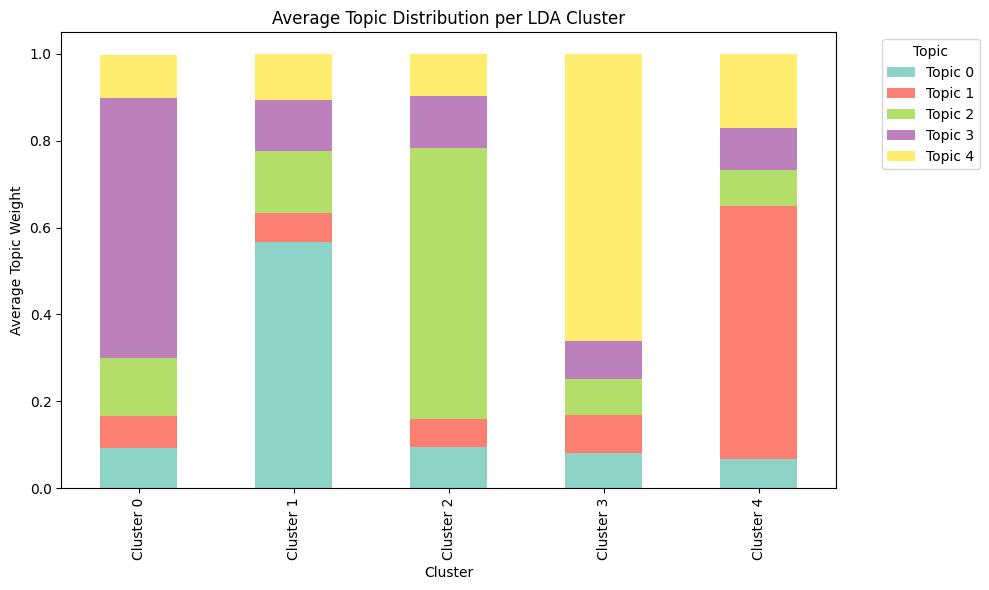

LDA clustering provided a more interpretable structure, with each cluster clearly leaning toward a different LDA topic. However, overlap across secondary topics in each cluster slightly weakened their distinctiveness.

**GloVe + LDA Concatenated Vectors**

*   Best k: 2 clusters
*   Silhouette Score: 0.0921

This hybrid approach aimed to combine semantic depth (GloVe) and thematic structure (LDA). While theoretically promising, the results were not substantially better than LDA alone, and clusters lacked clarity in differentiation.

**TF-IDF + SVD**

*   Best k: 6 clusters
*   Silhouette Score: 0.0794

Top Terms per Cluster:

*   Cluster 0: uncomfortable bed, room, pillow
*   Cluster 1: small rooms, narrow bathroom
*   Cluster 2: generic positive or mixed terms
*   Cluster 3: breakfast diversity and quality
*   Cluster 4: old furniture and wear
*   Cluster 5: price complaints

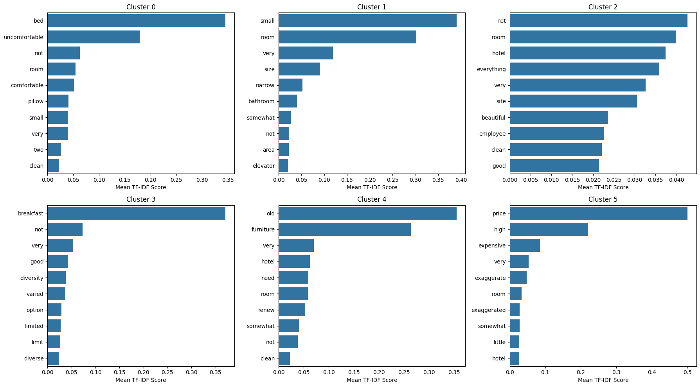

Despite a low silhouette score, this setup yielded the most interpretable clusters, each mapping well to a general topic such as comfort issues, bathroom size, price dissatisfaction, etc. Cluster 2 was a catch-all with over 48,000 reviews, possibly due to generic language.

---

## 6\. Dashboard

The Hotel Reviews Dashboard is an interactive web application built with Dash that allows users to explore and analyze hotel review data across different countries. The dashboard includes the following key features:
*   Choropleth Map: displays the number of reviews per country with color coding to highlight countries with the most reviews. Users can click on a country to dynamically update the rest of the dashboard, including the statistics and visuals below.
   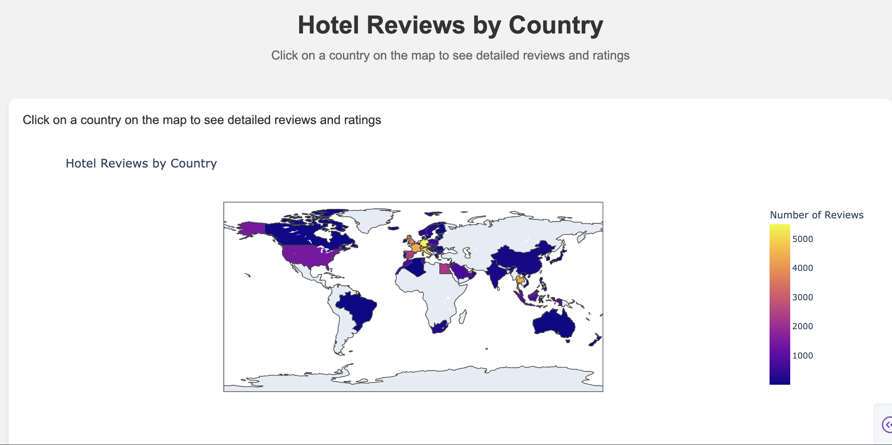

*   Word Cloud: visualizes the most frequently mentioned words in reviews for the selected country. This provides a quick, intuitive view of common topics or sentiments mentioned by reviewers.
   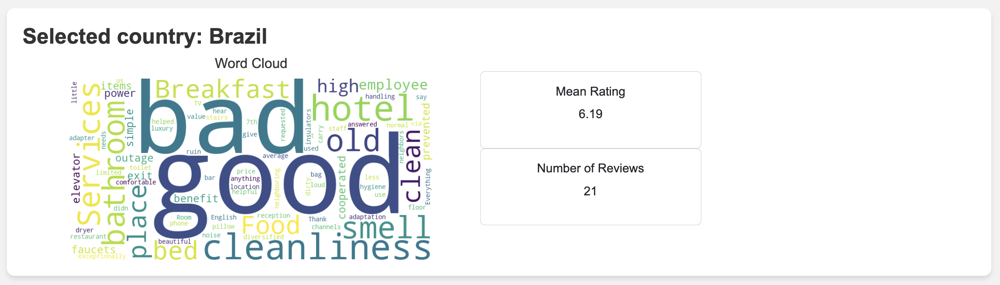

*   Stats Cards: displays key statistics for the selected country, including the mean rating (average hotel rating) and the total number of reviews. These cards update dynamically based on the country selected via the map.

*   LDA Topic Modeling: shows the most common topics derived from the reviews using Latent Dirichlet Allocation (LDA). It helps to uncover patterns such as satisfaction with hotel services, room conditions, amenities, and more, providing a deeper understanding of the customer feedback.
     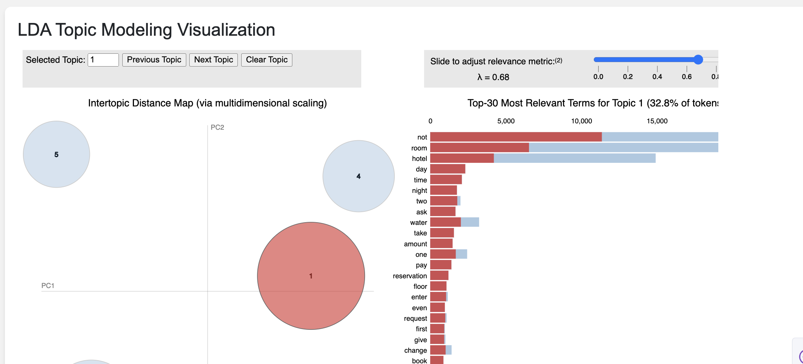

*   3D LDA Clusters: a 3D scatter plot that visualizes the distribution of LDA clusters. The clusters represent different review topics, and the 3D plot allows users to interactively explore the relationships between them.
     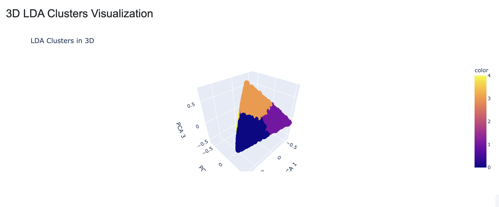

This dashboard offers a dynamic, interactive way to analyze hotel review data, providing valuable insights into customer feedback across various countries.

---

## 7\. Conclusion

What initially appeared to be a straightforward project turned out to be far more challenging than we anticipated, especially the dataset creation phase. Gathering and preparing high-quality review data from Booking.com required considerable effort, including overcoming scraping restrictions, managing language inconsistencies, and handling unreliable translations. These obstacles forced us to adapt constantly and apply many of the tools and techniques learned throughout the course.

Despite the difficulties, the project has been an very enriching learning experience, showing how theoretical concepts translate into practical solutions when facing complex real-world tasks.

---
